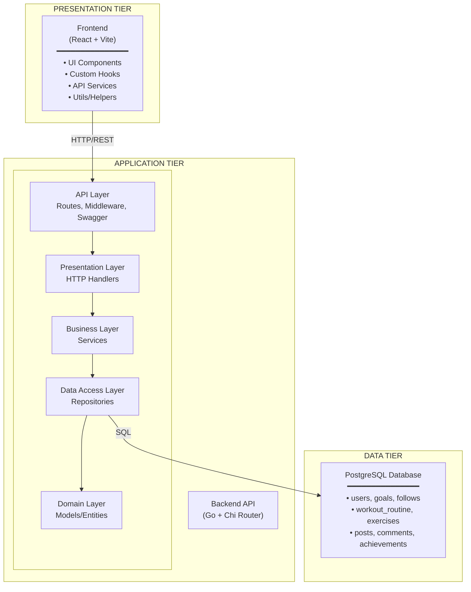

# Sprint 2 Worksheet

---

## 1. Regression Testing

**Describe how you run regression testing:**

Regression tests are automatically triggered via GitHub Actions when a PR is created for both frontend and backend. Manual execution is supported for local development.

**Automated:** GitHub Actions CI/CD runs full test suite on every PR

**Manual:**
```bash
# Backend
go test ./... -coverpkg=./... -covermode=atomic -coverprofile=coverage.out

# Frontend (requires backend running)
npm run regression
```

**Tests executed:**

**Full Regression Testing** - all tests run on every change.

**Backend:**
- Unit tests for service layer business logic
- Integration tests for repository layer (PostgreSQL + in-memory)
- Handler tests for HTTP endpoints
- Files: `handler_test.go`, `repository_test.go`

**Frontend:**
- Unit tests for utility functions and components
- E2E acceptance tests for backend integration

**Tools used:**
- **Backend:** Go testing package + coverage tools
- **Frontend:** Vitest (unit), Cypress (E2E)
- **CI/CD:** GitHub Actions

**Regression testing script:**

*Backend:*
```bash
# Run tests with coverage
go test ./... -coverpkg=./... -covermode=atomic -coverprofile=coverage.out

# View coverage
go tool cover -func=coverage.out
go tool cover -html=coverage.out
```

*Frontend:*
```bash
npm run regression
```

**Latest execution results:**

**Backend (November 6, 2025):**
```
✅ 259 tests passed
Execution time: ~7.6s

Package Coverage:
- src/internal/api:         10.1% coverage (5 tests)
- src/internal/config:       0.2% coverage (2 tests)
- src/internal/handler:     32.0% coverage (95 tests)
- src/internal/repository:  20.6% coverage (103 tests)
- src/internal/service:     17.5% coverage (78 tests)
- src/test/e2e:             35.0% coverage (38 E2E tests)
- src/util:                  1.1% coverage (4 tests)

Overall: 35.0% of statements covered
```

**Frontend (November 6, 2025):**
```
✅ 63 tests passed

E2E Tests (Cypress):
- auth.cy.ts:                    4 tests passed
- achievements/achievements.cy.ts: 2 tests passed  
- profile/profile.cy.ts:         5 tests passed
- routines/routineBuilder.cy.ts: 3 tests passed
- routines/routineScheduler.cy.ts: 3 tests passed
Total E2E: 17 tests passed in 1:22m

Unit Tests (Vitest):
- components/__unit_tests__:     6 tests passed
- utils/__unit_tests__:         15 tests passed
- services/__unit_tests__:      15 tests passed
- hooks/__unit_tests__:         10 tests passed
Total Unit: 46 tests passed in ~ 6s

Overall: 63 tests passed in 1:28m
```
Frontend coverage output can be found [here.](https://github.com/Onyelechie/WorkoutPal-Frontend/blob/main/documentation/tests/sprint_2_test_coverage.txt)


**Notes:**
while coverage looks low for the backend, this is just because of how we organised our codebase. not every folder contains code that needs to be tested.


---

## 2. Testing Slowdown

**Have you been able to keep all unit and integration tests from your test plan?**  

Yes, we have been able to keep and maintain all tests from the test plan

**Have you created different test plans for different release types?**  

No, we plan to keep up to date with our tests and run full regression for every release. this ensures that for every release we know that all functionality is still operating as expected

---

## 3. Not Testing

**What parts of the system are not tested?**

**Backend:**
- Main application entry point (cmd/api/main.go)
- Middleware layer (authentication, CORS, logging)
- Database connection initialization
- In-memory repository implementations

**Frontend:**
- Navigation components (Header, Footer)
- Dialog components (AlertDialog, ConfirmDialog)
- Most custom hooks (useActivity, useRoutines, useSchedules)
- Page components (HomePage, ProfilePage, etc.)
- CSS styling and responsive design

**Updated System Diagram:**



**Testing Coverage by Layer:**

| Tier | Layer | Component | Testing Level | Coverage (%) |
|------|-------|-----------|---------------|---------------|
| **Application** | Entry Point | main.go | Not tested | 0% |
| **Application** | API Layer | Route Registration | Fully tested | 100% |
| **Application** | API Layer | Middleware | Mostly tested | 24-33% |
| **Application** | API Layer | Swagger Docs | Fully tested | 100% |
| **Application** | Presentation Layer | HTTP Handlers | Fully tested | 67-100% |
| **Application** | Business Layer | Service Logic | Fully tested | 100% |
| **Application** | Data Access Layer | PostgreSQL Repository | Fully tested | 73-100% |
| **Application** | Data Access Layer | In-Memory Repository | Not tested | 0% |
| **Application** | Domain Layer | Models/Entities | Not tested | N/A |
| **Application** | Utility Layer | Validators | Fully tested | 100% |
| **Application** | Configuration | Config Loading | Fully tested | 100% |
| **Presentation** | UI Layer | React Components | Mostly tested | ~30% |
| **Presentation** | UI Layer | Pages/Routes | Not tested | 0% |
| **Presentation** | Application Layer | API Services | Fully tested | 100% |
| **Presentation** | Application Layer | Utils/Helpers | Fully tested | 100% |
| **Presentation** | Application Layer | Custom Hooks | Somewhat tested | ~15% |

**Coverage Reports:**

Backend coverage report: [coverage.txt](../coverage.txt)

Frontend coverage report: [coverage.txt](https://github.com/Onyelechie/WorkoutPal-Frontend/blob/main/documentation/tests/sprint_2_test_coverage.txt)

---

## 4. Profiler

The slowest endpoint is GET /exercises. This is because we have preloaded ~1300 exercises into the database and currently query them all at once. This could be improved by reducing the load on the database through pagination and indexing.

profiler output: [profiler output](./misc/profilerOut.txt)

---

## 5. Last Dash

**Issues Foreseen in Final Sprint:**
- We may struggle with creating a modern UI for our app, since we will be focussing on the last few features. 
- The minimal remaining time may cause problems while trying to get the last few features and preparing for presentations.

---

## 6. Show Off

Each team member highlights their best work (must be individually committed):

| Team Member | Area of Work | Description |
|--------------|---------------|--------------|
|Taren|Cloud/CD|set up CD and deployments to azure static web app (frontend), azure app service (backend), and Azure Database for PostgreSQL flexible server (DB)|
|Christian|[Alert Dialog](https://github.com/Onyelechie/WorkoutPal-Frontend/commit/2aee5591cb13422df20b5044d008555723e19ddf) and [Confirm Dialog](https://github.com/Onyelechie/WorkoutPal-Frontend/pull/79) implementation| Created a reusable dialog component that is used by multiple pages. Examples include (showing achievements unlocked, error alerts and delete confirmation).|
|Kurt|Frontend|Built the routine scheduler and created backend domain interfaces for Max to finish. This is so that we can work simultaneously where I set up the frontend's routine scheduler for API endpoints that don't exist yet, increasing efficiency.| 
|Max|Backend / API|Wrote request handlers, service logic, SQL query and DB executions for a variety of CRUD endpoints including posts and achievements alongside unit tests for each layer. Added a new error response object which provides a more detailed account of what went wrong.|

---

### ✅ Sprint 2 Quick Checklist

- [ ] Regression testing process described  
- [ ] Link to regression script + last results  
- [ ] Testing slowdown discussed  
- [ ] Untested parts identified + updated system diagram  
- [ ] Tier testing coverage levels stated  
- [ ] Coverage reports included  
- [ ] API profiler run + slowest endpoint identified  
- [ ] Profiler output attached/linked  
- [ ] Issues for final sprint listed  
- [ ] Each member's "best work" committed & described

---
